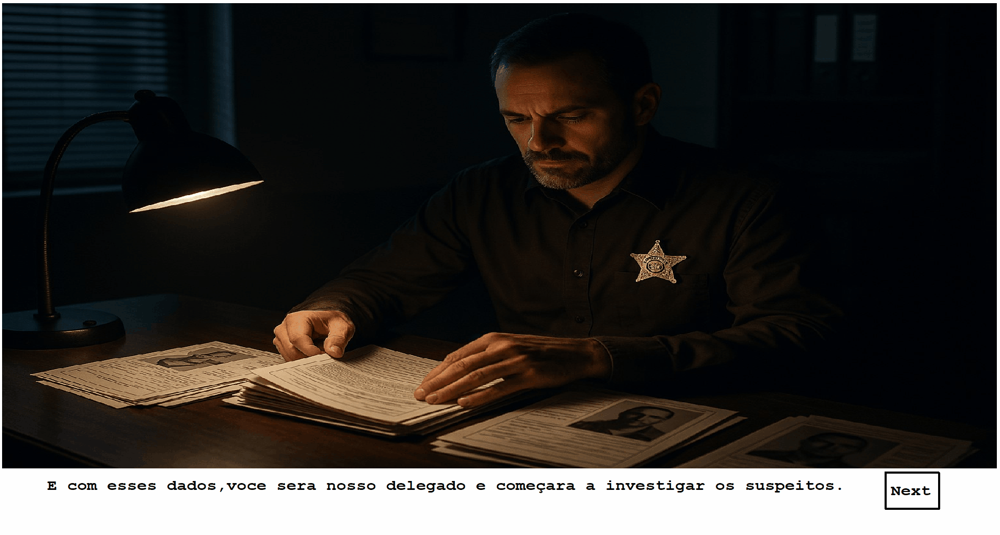

# 🔍 Projeto Interface em C - Jogo de Investigação Policial

Este projeto é um jogo investigativo desenvolvido em linguagem C utilizando a biblioteca **C-graphics**. O jogador assume o papel de um detetive, interagindo com personagens e pistas para resolver um mistério.
Desenvolvido para a matéria de Algoritmos e Estruturas de Dados 1, 1 periodo.
## 🎮 Sobre o jogo

O jogo simula uma investigação policial com foco narrativo. Por meio de uma interface gráfica em C, o jogador pode:

- Navegar entre múltiplas telas do jogo com o **mouse**;
- Acessar **fichas de suspeitos** e **testemunhas**;
- Analisar **evidências visuais** e tomar decisões com base em diálogos e pistas;
- Progredir na história e descobrir o culpado.

O projeto foi estruturado de forma modular, com foco em organização de código, uso de **ponteiros para funções**, **structs**, e **interação gráfica com o usuário**.

## 🛠️ Tecnologias e ferramentas

- Linguagem C
- Biblioteca gráfica: [`graphics.h` (C-graphics)](https://github.com/ibraheemdev/graphics)
- IDE: Code::Blocks
- Estrutura modular (dividido em múltiplos arquivos `.c` e `.h`)
- Git e GitHub para controle de versão
  ## Um pouco dele funcionando:

